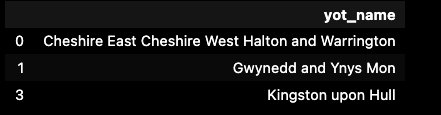

# Examples of functions

## standardise_cms_yjs

**Input**
```
import pandas as pd
import hudau.datacleaning as hd
df = pd.DataFrame({'yot_name': ['Cheshire East, Cheshire West, Halton and Warrington',
    'Gwynedd & Ynys Mon',
    "Western Bay",'Kingston-upon-Hull']})
df_clean = hd.standardise_cms_yjs(df, 'yot_name')
df_clean.head()

```

**Output**



## get_list_unique_labels

**Input**
```
import hudau.datacleaning as hd 
df = pd.DataFrame({'yot_name': ['Cheshire East, Cheshire West, Halton and Warrington',
    'Gwynedd & Ynys Mon',
    "Western Bay",'Kingston-upon-Hull']})
hd.get_list_unique_labels(df, 'yot_name')
```

**Output**
```
['Cheshire East, Cheshire West, Halton and Warrington',
 'Gwynedd & Ynys Mon',
 'Western Bay',
 'Kingston-upon-Hull']

```

## check_non_matching_values

**Input**
```
import hudau.datacleaning as hd 
list1 = ['Cheshire East, Cheshire West, Halton and Warrington',
    'Gwynedd & Ynys Mon',
    "Western Bay",'Kingston-upon-Hull']
list2 = ['Cornwall', 'Stoke-on-Trent', 'Cheshire East, Cheshire West, Halton and Warrington', 'Kingston-upon-Hull']
hd.check_non_matching_values(list1, list2)
```

**Output**
```
The following from values list_values1 do not match list_values2  {'Gwynedd & Ynys Mon', 'Western Bay'}
The following from values list_values2 do not match list_values1 {'Cornwall', 'Stoke-on-Trent'}

```


## convert_quarter
**Input**
```
quarter_end_date = 'Mar-23'
converted_date = convert_quarter(quarter_end_date)
print(converted_date)
```

**Output**
```
2023-03-31
```


In this example, we pass the string 'Mar-23' representing the quarter end date to the convert_quarter function. The function converts the quarter end date to the format 'yyyy-mm-dd', where 'yyyy' is the year of the quarter end and 'mm-dd' represents the last day of the quarter. The output 2023-03-31 is then printed, indicating that the quarter end date 'Mar-23' corresponds to March 31, 2023.

## convert_month
**Input**
```
month_abbr = 'Jul'
converted_month = convert_month(month_abbr)
print(converted_month)
```

**Output**
```
07
```

In this example, we pass the string 'Jul' representing the three-letter abbreviation of the month to the convert_month function. The function converts the month abbreviation to a numeric value. The output 07 is then printed, indicating that the month abbreviation 'Jul' corresponds to the numeric value 07, representing July.